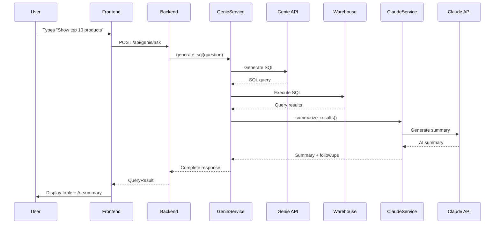
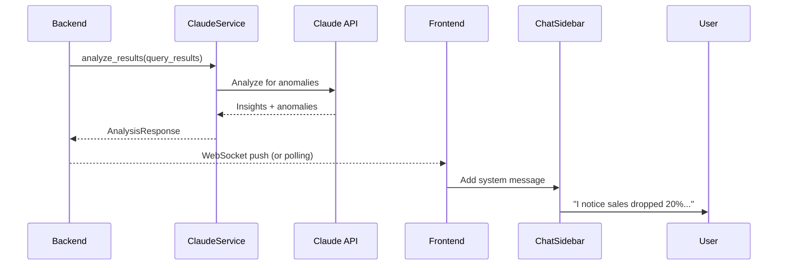

# Technical Design Document: Nielsen Sales Analytics Assistant

## High-Level Architecture

### System Overview

```
┌─────────────────────────────────────────────────────────────────────┐
│                         User's Browser                               │
│  ┌──────────────────────────────────────────────────────────────┐  │
│  │  React Frontend (TypeScript + shadcn/ui)                      │  │
│  │  ├── DashboardEmbed (iframe)                                  │  │
│  │  ├── ChatSidebar (AI Assistant)                               │  │
│  │  ├── QueryInput (Natural Language)                            │  │
│  │  └── ResultsPanel (Table + AI Summary)                        │  │
│  └──────────────────────────────────────────────────────────────┘  │
│                            ↓ ↑                                       │
│                      REST API (JSON)                                 │
└─────────────────────────────────────────────────────────────────────┘
                               ↓ ↑
┌─────────────────────────────────────────────────────────────────────┐
│                    FastAPI Backend (Python)                          │
│  ┌──────────────────────────────────────────────────────────────┐  │
│  │  Routers                                                       │  │
│  │  ├── /api/genie/* (Query generation & execution)              │  │
│  │  ├── /api/claude/* (AI assistant)                             │  │
│  │  └── /api/dashboard/* (Dashboard config)                      │  │
│  └──────────────────────────────────────────────────────────────┘  │
│  ┌──────────────────────────────────────────────────────────────┐  │
│  │  Services                                                      │  │
│  │  ├── GenieService (Databricks SDK)                            │  │
│  │  ├── ClaudeService (HTTP client)                              │  │
│  │  ├── WarehouseService (SQL execution)                         │  │
│  │  └── CacheService (In-memory cache)                           │  │
│  └──────────────────────────────────────────────────────────────┘  │
└─────────────────────────────────────────────────────────────────────┘
        ↓                    ↓                    ↓
┌──────────────┐  ┌──────────────────┐  ┌────────────────────────┐
│   Genie API  │  │ Claude Endpoint  │  │  SQL Warehouse         │
│ (Space ID)   │  │ (Model Serving)  │  │  (939811bf15d2854c)    │
└──────────────┘  └──────────────────┘  └────────────────────────┘
```

---

## Technology Stack

### Backend Framework
- **FastAPI 0.116.0** (already in template)
- **Python 3.13** with `uv` package manager
- **Databricks SDK 0.59.0** (already installed)
- **httpx** for Claude API calls (async HTTP client)

### Frontend Framework
- **React 18.3.1** with TypeScript 5.8.3
- **Vite 5.4.19** for fast development
- **shadcn/ui** components with Tailwind CSS
- **React Query (TanStack Query)** for API state management
- **Zustand** for chat history state

### Key Libraries to Add

**Backend (via `uv add`):**
- `httpx` - Async HTTP client for Claude endpoint
- `cachetools` - In-memory caching (already installed ✓)
- `pandas` - Data manipulation for query results (already installed ✓)

**Frontend (via `bun add`):**
- `zustand` - Lightweight state management for chat
- `react-markdown` - Render Claude responses with formatting
- `@tanstack/react-table` - Advanced data table for query results
- `recharts` - Charts library (already installed ✓)

---

## Database & External Systems

### Data Sources
- **Primary Data:** `p_coe_gold.ofs_nielsen.nielsen_sales_metrics`
- **Warehouse:** `939811bf15d2854c`
- **Genie Space:** `01f0a834208e13dab88b1fd3f7d718c0`

### External APIs
1. **Genie API:** `/api/2.0/genie/spaces/{space_id}/...` (via Databricks SDK)
2. **Claude Endpoint:** `https://adb-4295693306818923.3.azuredatabricks.net/serving-endpoints/databricks-claude-sonnet-4-5/invocations`
3. **SQL Warehouse:** Connection via Databricks SDK
4. **Dashboard:** `https://adb-4295693306818923.3.azuredatabricks.net/dashboardsv3/01f0a8ea42f5124ba8182d499c5c292f/published?o=4295693306818923`

---

## Architecture Decisions

### 1. Caching Strategy
**Decision:** In-memory cache with 5-minute TTL

**Rationale:**
- Reduces Genie API costs for repeated questions
- 5-minute TTL ensures data freshness for most use cases
- Simple implementation with `cachetools.TTLCache`

**Implementation:**
```python
from cachetools import TTLCache
query_cache = TTLCache(maxsize=100, ttl=300)  # 100 queries, 5 min TTL
```

### 2. Error Recovery
**Decision:** Hybrid approach with AI assistance

**Flow:**
1. Show business-friendly error message
2. Ask Claude to suggest better question phrasing
3. Display suggested rephrasings as clickable options
4. Allow manual rephrasing

**Example:**
```
Error: Could not generate SQL for your question.

Claude suggests trying:
• "Show the top 10 products by sales volume this quarter"
• "What are the best-selling products in Q3 2024?"
```

### 3. Dashboard Security
**Decision:** OAuth token passthrough

**Implementation:**
- Frontend requests dashboard with user's OAuth token
- Backend generates dashboard URL with embedded auth token
- iframe uses user's session credentials

**Security:**
- Token never exposed to client-side JavaScript
- Short-lived tokens (refresh every 30 minutes)
- Same-origin policy enforced

### 4. Query Performance Optimization
**Decision:** Progressive enhancement with cancellation

**Features:**
- Loading indicator appears immediately
- Show query execution progress (if available from warehouse)
- Allow cancellation within 30 seconds
- Timeout after 30 seconds with helpful message

**UI States:**
```typescript
type QueryState = 'idle' | 'generating-sql' | 'executing' | 'success' | 'error' | 'cancelled'
```

---

## Frontend Architecture

### Component Structure

```
client/src/
├── components/
│   ├── ui/              (existing shadcn components)
│   ├── layout/
│   │   ├── AppLayout.tsx           (Main layout with sidebar)
│   │   └── Header.tsx              (App header with user info)
│   ├── dashboard/
│   │   ├── DashboardEmbed.tsx      (Iframe wrapper with auth)
│   │   └── DashboardControls.tsx   (Refresh, fullscreen)
│   ├── chat/
│   │   ├── ChatSidebar.tsx         (Main chat interface)
│   │   ├── ChatMessage.tsx         (Single message component)
│   │   ├── ChatInput.tsx           (Message input with suggestions)
│   │   └── SuggestedQuestions.tsx  (Predefined question buttons)
│   ├── query/
│   │   ├── QueryInput.tsx          (Natural language input)
│   │   ├── ResultsPanel.tsx        (Split view: table + AI summary)
│   │   ├── ResultsTable.tsx        (Data grid with sorting/filtering)
│   │   └── AISummary.tsx           (Claude interpretation)
│   └── common/
│       ├── LoadingSpinner.tsx      (Loading states)
│       ├── ErrorMessage.tsx        (Error display)
│       └── CancellableQuery.tsx    (Query with cancel button)
├── pages/
│   └── AnalyticsPage.tsx           (Main app page - replaces WelcomePage)
├── hooks/
│   ├── useGenie.ts                 (Genie API queries)
│   ├── useClaude.ts                (Claude API queries)
│   ├── useChatHistory.ts           (Chat state management)
│   └── useQueryCache.ts            (Client-side query cache)
├── stores/
│   └── chatStore.ts                (Zustand store for chat history)
├── lib/
│   ├── api-client.ts               (Enhanced API client)
│   └── utils.ts                    (existing utilities)
└── types/
    ├── genie.ts                    (Genie API types)
    ├── claude.ts                   (Claude API types)
    └── analytics.ts                (App-specific types)
```

### State Management Strategy

**React Query for Server State:**
- API calls to backend
- Automatic caching and refetching
- Loading/error states

**Zustand for UI State:**
- Chat history (messages, context)
- Query results history
- UI preferences (sidebar expanded, etc.)

**Example Zustand Store:**
```typescript
interface ChatState {
  messages: Message[]
  addMessage: (message: Message) => void
  clearHistory: () => void
  queryContext: QueryContext | null
  setQueryContext: (context: QueryContext) => void
}
```

---

## Backend Architecture

### Service Layer

#### GenieService (`server/services/genie_service.py`)

**Responsibilities:**
- Generate SQL from natural language
- Execute queries via Genie
- Handle Genie API errors
- Cache query results

**Key Methods:**
```python
class GenieService:
    def __init__(self, workspace_client, space_id: str, warehouse_id: str):
        self.client = workspace_client
        self.space_id = space_id
        self.warehouse_id = warehouse_id
        self.query_cache = TTLCache(maxsize=100, ttl=300)

    async def generate_sql(self, question: str) -> GenieResponse:
        """Generate SQL from natural language question"""

    async def execute_query(self, sql: str) -> QueryResults:
        """Execute SQL on warehouse and return results"""

    async def ask_question(self, question: str) -> FullQueryResult:
        """End-to-end: generate SQL + execute + return results"""
```

#### ClaudeService (`server/services/claude_service.py`)

**Responsibilities:**
- Send prompts to Claude endpoint
- Manage conversation context
- Generate AI summaries of query results
- Provide proactive insights

**Key Methods:**
```python
class ClaudeService:
    def __init__(self, endpoint_url: str, token: str):
        self.endpoint_url = endpoint_url
        self.client = httpx.AsyncClient()
        self.token = token

    async def chat(self, message: str, context: ConversationContext) -> ClaudeResponse:
        """Send chat message with context"""

    async def summarize_results(self, query_results: QueryResults) -> AISummary:
        """Generate business summary of query results"""

    async def suggest_followup_questions(self, query_results: QueryResults) -> List[str]:
        """Suggest relevant follow-up questions"""

    async def explain_error(self, error: str, original_question: str) -> ErrorExplanation:
        """Provide business-friendly error explanation"""
```

#### WarehouseService (`server/services/warehouse_service.py`)

**Responsibilities:**
- Direct SQL execution on warehouse (fallback)
- Query cancellation
- Result pagination

**Key Methods:**
```python
class WarehouseService:
    def __init__(self, workspace_client, warehouse_id: str):
        self.client = workspace_client
        self.warehouse_id = warehouse_id

    async def execute_sql(self, sql: str, timeout: int = 30) -> QueryResults:
        """Execute SQL with timeout and cancellation support"""

    async def cancel_query(self, query_id: str):
        """Cancel running query"""
```

### Router Structure

#### Genie Router (`server/routers/genie.py`)

**Endpoints:**
```python
@router.post("/api/genie/ask")
async def ask_question(request: AskQuestionRequest) -> AskQuestionResponse:
    """
    Ask natural language question, get SQL + results + AI summary

    Request:
    {
      "question": "Show top 10 products by sales this quarter",
      "context": {
        "conversation_id": "uuid",
        "previous_queries": [...]
      }
    }

    Response:
    {
      "sql": "SELECT ...",
      "results": {
        "columns": [...],
        "rows": [...],
        "row_count": 10
      },
      "ai_summary": "The top 10 products show...",
      "execution_time_ms": 234,
      "query_id": "uuid"
    }
    """

@router.get("/api/genie/suggestions")
async def get_suggested_questions() -> List[str]:
    """Get predefined question suggestions"""

@router.post("/api/genie/cancel/{query_id}")
async def cancel_query(query_id: str):
    """Cancel running query"""
```

#### Claude Router (`server/routers/claude.py`)

**Endpoints:**
```python
@router.post("/api/claude/chat")
async def chat(request: ChatRequest) -> ChatResponse:
    """
    Send message to Claude with conversation context

    Request:
    {
      "message": "Why did sales drop in Region X?",
      "context": {
        "conversation_history": [...],
        "current_query_results": {...},
        "dashboard_state": {...}
      }
    }

    Response:
    {
      "message": "Sales dropped in Region X due to...",
      "suggested_followups": [
        "Would you like to see product-level breakdown?",
        "Should we compare with previous periods?"
      ],
      "confidence": 0.85
    }
    """

@router.post("/api/claude/analyze")
async def analyze_results(request: AnalyzeRequest) -> AnalysisResponse:
    """Generate proactive insights from query results"""

@router.post("/api/claude/explain-error")
async def explain_error(request: ErrorRequest) -> ErrorExplanation:
    """Get business-friendly error explanation"""
```

#### Dashboard Router (`server/routers/dashboard.py`)

**Endpoints:**
```python
@router.get("/api/dashboard/config")
async def get_dashboard_config() -> DashboardConfig:
    """
    Get dashboard configuration including embed URL

    Response:
    {
      "dashboard_url": "https://...",
      "dashboard_id": "01f0a8ea42f5124ba8182d499c5c292f",
      "embed_token": "...",
      "expires_at": "2025-11-04T08:30:00Z"
    }
    """

@router.post("/api/dashboard/refresh-token")
async def refresh_dashboard_token() -> TokenResponse:
    """Refresh dashboard embed token"""
```

---

## Data Models

### Backend Models (`server/models/`)

```python
# server/models/genie_models.py
from pydantic import BaseModel
from typing import List, Optional, Dict, Any

class AskQuestionRequest(BaseModel):
    question: str
    context: Optional[Dict[str, Any]] = None

class QueryResults(BaseModel):
    columns: List[str]
    rows: List[List[Any]]
    row_count: int
    truncated: bool = False

class GenieResponse(BaseModel):
    sql: str
    results: QueryResults
    ai_summary: str
    execution_time_ms: int
    query_id: str
    cached: bool = False

class AskQuestionResponse(BaseModel):
    sql: str
    results: QueryResults
    ai_summary: str
    suggested_followups: List[str]
    execution_time_ms: int
    query_id: str

# server/models/claude_models.py
class ConversationContext(BaseModel):
    conversation_history: List[Dict[str, str]]
    current_query_results: Optional[QueryResults] = None
    dashboard_state: Optional[Dict[str, Any]] = None

class ChatRequest(BaseModel):
    message: str
    context: ConversationContext

class ChatResponse(BaseModel):
    message: str
    suggested_followups: List[str]
    confidence: float

class AnalyzeRequest(BaseModel):
    query_results: QueryResults
    query_sql: str

class AnalysisResponse(BaseModel):
    insights: List[str]
    anomalies: List[str]
    recommendations: List[str]
```

### Frontend Types (`client/src/types/`)

```typescript
// client/src/types/analytics.ts
export interface QueryResult {
  sql: string
  results: {
    columns: string[]
    rows: any[][]
    rowCount: number
  }
  aiSummary: string
  suggestedFollowups: string[]
  executionTimeMs: number
  queryId: string
}

export interface ChatMessage {
  id: string
  role: 'user' | 'assistant' | 'system'
  content: string
  timestamp: Date
  queryResults?: QueryResult
}

export interface DashboardConfig {
  dashboardUrl: string
  dashboardId: string
  embedToken: string
  expiresAt: Date
}
```

---

## API Flow Examples

### Example 1: User Asks Question



### Example 2: Proactive Insight



---

## Configuration Management

### Environment Variables (`.env.local`)

```bash
# Existing variables
DATABRICKS_HOST=https://adb-4295693306818923.3.azuredatabricks.net
DATABRICKS_AUTH_TYPE=databricks-cli
DATABRICKS_CONFIG_PROFILE=adb-prod
DATABRICKS_APP_NAME=mathias-pse-test

# New variables to add
DATABRICKS_WAREHOUSE_ID=939811bf15d2854c
GENIE_SPACE_ID=01f0a834208e13dab88b1fd3f7d718c0
CLAUDE_ENDPOINT=/serving-endpoints/databricks-claude-sonnet-4-5/invocations
DASHBOARD_ID=01f0a8ea42f5124ba8182d499c5c292f
QUERY_CACHE_TTL=300
QUERY_TIMEOUT=30
```

### App Configuration (`server/config.py`)

```python
from pydantic_settings import BaseSettings

class Settings(BaseSettings):
    # Databricks
    databricks_host: str
    databricks_warehouse_id: str
    genie_space_id: str
    claude_endpoint: str
    dashboard_id: str

    # Query settings
    query_cache_ttl: int = 300
    query_timeout: int = 30
    max_query_results: int = 1000

    # Feature flags
    enable_proactive_insights: bool = True
    enable_query_caching: bool = True

    class Config:
        env_file = ".env.local"

settings = Settings()
```

---

## Implementation Plan

### Phase 1: Foundation - Dashboard + Basic Q&A (Week 1-2)

#### Step 1.1: Setup Environment & Dependencies
**Files to modify:**
- `.env.local` - Add new environment variables
- `pyproject.toml` - Add httpx if not present
- `client/package.json` - Add zustand, react-markdown, @tanstack/react-table

**Commands:**
```bash
# Backend
uv add httpx

# Frontend
cd client
bun add zustand react-markdown @tanstack/react-table
```

#### Step 1.2: Backend - Configuration & Models
**Files to create:**
- `server/config.py` - Application configuration
- `server/models/genie_models.py` - Genie data models
- `server/models/claude_models.py` - Claude data models
- `server/models/__init__.py` - Export all models

**Files to modify:**
- `server/app.py` - Add new routers

#### Step 1.3: Backend - Genie Service
**Files to create:**
- `server/services/genie_service.py` - Genie integration
- `server/services/warehouse_service.py` - SQL execution

**Implementation order:**
1. Create basic GenieService class
2. Implement `generate_sql()` method
3. Implement `execute_query()` method
4. Add caching logic
5. Add error handling

#### Step 1.4: Backend - Genie Router
**Files to create:**
- `server/routers/genie.py` - Genie API endpoints

**Endpoints to implement:**
1. `POST /api/genie/ask` - Main question endpoint
2. `GET /api/genie/suggestions` - Predefined questions
3. `POST /api/genie/cancel/{query_id}` - Query cancellation

#### Step 1.5: Backend - Dashboard Router
**Files to create:**
- `server/routers/dashboard.py` - Dashboard configuration

**Endpoints to implement:**
1. `GET /api/dashboard/config` - Dashboard embed URL
2. `POST /api/dashboard/refresh-token` - Token refresh

#### Step 1.6: Frontend - Type Definitions
**Files to create:**
- `client/src/types/genie.ts` - Genie types
- `client/src/types/claude.ts` - Claude types
- `client/src/types/analytics.ts` - App-specific types

#### Step 1.7: Frontend - API Hooks
**Files to create:**
- `client/src/hooks/useGenie.ts` - Genie API queries
- `client/src/hooks/useDashboard.ts` - Dashboard config

**Example hook:**
```typescript
export function useAskQuestion() {
  return useMutation({
    mutationFn: async (question: string) => {
      const response = await apiClient.post('/api/genie/ask', { question })
      return response.data
    }
  })
}
```

#### Step 1.8: Frontend - Dashboard Component
**Files to create:**
- `client/src/components/dashboard/DashboardEmbed.tsx`
- `client/src/components/dashboard/DashboardControls.tsx`

**Features:**
- Iframe with OAuth token
- Loading state
- Error handling
- Refresh button

#### Step 1.9: Frontend - Query Components
**Files to create:**
- `client/src/components/query/QueryInput.tsx`
- `client/src/components/query/ResultsTable.tsx`
- `client/src/components/query/SuggestedQuestions.tsx`

**Features:**
- Text input with submit
- Predefined question buttons
- Data table with @tanstack/react-table

#### Step 1.10: Frontend - Main Page
**Files to modify:**
- `client/src/pages/WelcomePage.tsx` → Rename/replace with `AnalyticsPage.tsx`
- `client/src/App.tsx` - Update route to AnalyticsPage

**Layout:**
- Main content area with dashboard
- Bottom panel for query input and results

#### Step 1.11: Integration Testing
**Tasks:**
1. Test Genie SQL generation
2. Test query execution
3. Test dashboard embedding
4. Test end-to-end query flow

**Verification:**
```bash
# Start dev server
nohup ./watch.sh > /tmp/databricks-app-watch.log 2>&1 &

# Test Genie endpoint
curl -X POST http://localhost:8000/api/genie/ask \
  -H "Content-Type: application/json" \
  -d '{"question": "Show top 10 products by sales"}'

# Check frontend
# Open http://localhost:5173 in Playwright
```

---

### Phase 2: Intelligence - AI Assistant (Week 3-4)

#### Step 2.1: Backend - Claude Service
**Files to create:**
- `server/services/claude_service.py` - Claude integration

**Methods to implement:**
1. `chat()` - Basic chat with context
2. `summarize_results()` - Generate AI summaries
3. `suggest_followup_questions()` - Question suggestions
4. `explain_error()` - Business-friendly errors

#### Step 2.2: Backend - Claude Router
**Files to create:**
- `server/routers/claude.py` - Claude API endpoints

**Endpoints to implement:**
1. `POST /api/claude/chat` - Chat with context
2. `POST /api/claude/analyze` - Proactive analysis
3. `POST /api/claude/explain-error` - Error explanations

#### Step 2.3: Backend - Integration Updates
**Files to modify:**
- `server/routers/genie.py` - Add Claude summarization to responses
- `server/services/genie_service.py` - Integrate Claude service

**Changes:**
- After query execution, call Claude for summary
- Add suggested follow-ups to response

#### Step 2.4: Frontend - Chat State Management
**Files to create:**
- `client/src/stores/chatStore.ts` - Zustand store

**State to manage:**
- Chat messages
- Conversation context
- Query history

#### Step 2.5: Frontend - Chat Components
**Files to create:**
- `client/src/components/chat/ChatSidebar.tsx`
- `client/src/components/chat/ChatMessage.tsx`
- `client/src/components/chat/ChatInput.tsx`

**Features:**
- Message history
- User/assistant/system messages
- Markdown rendering
- Copy message functionality
- Typing indicator

#### Step 2.6: Frontend - AI Summary Component
**Files to create:**
- `client/src/components/query/AISummary.tsx`

**Features:**
- Display AI-generated summary
- Suggested follow-up questions (clickable)
- Expandable/collapsible

#### Step 2.7: Frontend - Layout Updates
**Files to modify:**
- `client/src/pages/AnalyticsPage.tsx` - Add sidebar layout

**New layout:**
```
[ChatSidebar (30%)] | [Dashboard (70%)]
                    | [Results Panel]
```

#### Step 2.8: Frontend - Claude Hooks
**Files to create:**
- `client/src/hooks/useClaude.ts` - Claude API queries
- `client/src/hooks/useChatHistory.ts` - Chat state hooks

#### Step 2.9: Integration Testing
**Tasks:**
1. Test Claude chat with context
2. Test AI summaries
3. Test follow-up questions
4. Test proactive insights

---

### Phase 3: Polish & Optimization (Week 5-6)

#### Step 3.1: Error Handling Improvements
**Files to modify:**
- `server/services/genie_service.py` - Enhanced error handling
- `server/routers/genie.py` - Error response formatting
- `client/src/components/common/ErrorMessage.tsx` - Better error UI

**Features:**
- Business-friendly error messages
- Suggested rephrasing via Claude
- Automatic retry with exponential backoff

#### Step 3.2: Performance Optimization
**Files to modify:**
- `server/services/genie_service.py` - Add query result pagination
- `client/src/components/query/ResultsTable.tsx` - Virtual scrolling

**Features:**
- Limit query results to 1000 rows
- Paginated loading
- Virtual scrolling for large datasets

#### Step 3.3: Loading States & Cancellation
**Files to create:**
- `client/src/components/common/CancellableQuery.tsx`

**Files to modify:**
- `client/src/components/query/QueryInput.tsx` - Add cancel button

**Features:**
- Show query execution progress
- Cancel button (30s timeout)
- Clear loading states

#### Step 3.4: Export Functionality
**Files to create:**
- `server/routers/export.py` - Export endpoints
- `client/src/components/query/ExportButton.tsx`

**Features:**
- Export to CSV
- Export to Excel (optional)
- Include AI summary in export

#### Step 3.5: User Feedback Collection
**Files to create:**
- `server/routers/feedback.py` - Feedback endpoints
- `client/src/components/common/FeedbackWidget.tsx`

**Features:**
- Rate AI responses (👍/👎)
- Submit feedback comments
- Track usage metrics

#### Step 3.6: Documentation
**Files to create:**
- `docs/api.md` - API documentation
- `docs/user-guide.md` - User guide
- `docs/deployment.md` - Deployment instructions

#### Step 3.7: Final Testing & Deployment
**Tasks:**
1. End-to-end testing
2. Performance testing (load test with 50 concurrent users)
3. Security audit
4. Deploy to Databricks Apps
5. Monitor logs with `dba_logz.py`

---

## Development Workflow

### Local Development
```bash
# Terminal 1: Start development server
nohup ./watch.sh > /tmp/databricks-app-watch.log 2>&1 &

# Terminal 2: Monitor logs
tail -f /tmp/databricks-app-watch.log

# Terminal 3: Test endpoints
curl http://localhost:8000/api/genie/ask -X POST -d '{"question":"test"}'
```

### Verification After Each Step
1. **Backend:** Test endpoint with curl
2. **Frontend:** View in Playwright browser
3. **Integration:** Test end-to-end flow
4. **Logs:** Check for errors in watch.log

### Deployment Process
```bash
# Test locally first
./watch.sh

# Deploy to Databricks
./deploy.sh --verbose

# Monitor deployment
uv run python dba_logz.py <app-url> --duration 60
```

---

## Testing Strategy

### Backend Testing
**Test files to create:**
- `tests/test_genie_service.py`
- `tests/test_claude_service.py`
- `tests/test_routers.py`

**Test scenarios:**
- Genie SQL generation
- Query execution
- Error handling
- Caching behavior
- Claude API integration

### Frontend Testing
**Test files to create:**
- `client/src/__tests__/components/QueryInput.test.tsx`
- `client/src/__tests__/hooks/useGenie.test.ts`

**Test scenarios:**
- Component rendering
- User interactions
- API integration
- State management

### Integration Testing
**Manual testing checklist:**
- [ ] Dashboard loads and is interactive
- [ ] Natural language questions generate SQL
- [ ] Query results display correctly
- [ ] AI summaries are relevant
- [ ] Follow-up questions work
- [ ] Error messages are helpful
- [ ] Chat history persists
- [ ] Proactive insights appear

---

## Security Considerations

### Authentication & Authorization
- OAuth via Databricks (already implemented)
- Token refresh for dashboard embeds
- No credential storage in frontend

### Data Access
- All queries through user's credentials
- No data caching on server (only SQL/query metadata)
- Audit logging of all queries

### API Security
- CORS properly configured
- Rate limiting on API endpoints
- Input validation on all requests

### Dashboard Embedding
- Secure iframe with token
- Same-origin policy
- Token expiration and refresh

---

## Monitoring & Observability

### Logging Strategy
**What to log:**
- All API requests/responses
- Query execution times
- Genie API calls
- Claude API calls
- Errors and exceptions

**Log format:**
```python
logger.info("Genie query", extra={
    "question": question,
    "sql": sql,
    "execution_time_ms": execution_time,
    "user": user_id,
    "cached": cached
})
```

### Metrics to Track
- Query success rate
- Average query execution time
- Genie API call count
- Claude API call count
- Error rate by endpoint
- Active users

### Alerting
- Query failures > 10% in 5 minutes
- API response time > 5 seconds
- Genie/Claude API errors

---

## Performance Targets

### Response Times
- Dashboard load: < 3s
- Genie SQL generation: < 2s
- Query execution: < 10s (95th percentile)
- Claude AI summary: < 5s
- Chat response: < 3s

### Scalability
- Support 50 concurrent users
- Handle 100 queries/minute
- Cache hit rate > 30%

### Resource Usage
- Backend memory: < 2GB
- Frontend bundle size: < 500KB gzipped

---

## Deployment Architecture

### Databricks Apps Platform
```
User Browser → Databricks Apps Platform → Your App
                                        ├── FastAPI Backend
                                        ├── React Frontend (static)
                                        └── OAuth Integration
```

### Environment Variables in Production
- Set in Databricks Apps configuration
- No secrets in code or `.env.local`
- Use Databricks secrets for sensitive data

### Deployment Process
1. Build frontend: `cd client && bun run build`
2. Generate requirements: `uv export --no-hashes > requirements.txt`
3. Deploy via CLI: `databricks apps deploy`
4. Monitor logs: `dba_logz.py <app-url>`
5. Verify endpoints: `dba_client.py <app-url> /health`

---

## Open Questions & Risks

### Technical Risks
1. **Genie API rate limits:** May need request throttling
2. **Large query results:** May exceed memory limits - implement streaming
3. **Dashboard embedding:** CORS or authentication issues - have fallback link
4. **Claude endpoint latency:** May be slow - implement optimistic UI updates

### Mitigation Strategies
- Implement aggressive caching
- Add query result pagination
- Provide fallback dashboard link
- Show loading states and allow cancellation

---

## Future Enhancements (Post-MVP)

### V2 Features
- **Multi-dashboard support:** Switch between different dashboards
- **Custom visualizations:** Auto-generate charts from query results
- **Collaborative features:** Share queries and insights
- **Scheduled reports:** Email reports on schedule
- **Mobile responsive:** Better mobile experience
- **Voice input:** Ask questions via voice
- **Real-time data:** WebSocket updates for live data

### Technical Improvements
- **Query result streaming:** Handle very large datasets
- **Distributed caching:** Redis for multi-instance deployments
- **Background jobs:** Celery for long-running queries
- **Real-time collaboration:** WebSocket for multi-user sessions

---

## Appendix

### Useful Commands

**Development:**
```bash
# Start dev server
./watch.sh

# Format code
./fix.sh

# Generate TypeScript client
cd client && bun run generate-client

# Run tests
uv run pytest
cd client && bun test
```

**Deployment:**
```bash
# Deploy
./deploy.sh --verbose

# Check app status
./app_status.sh

# Monitor logs
uv run python dba_logz.py <app-url> --duration 60

# Test endpoints
uv run python dba_client.py <app-url> /api/genie/suggestions
```

**Debugging:**
```bash
# Watch logs
tail -f /tmp/databricks-app-watch.log

# Check backend
curl http://localhost:8000/docs

# Check frontend
open http://localhost:5173
```

---

**Document Version:** 1.0
**Last Updated:** 2025-11-04
**Author:** Technical Design (Generated via /dba workflow)
